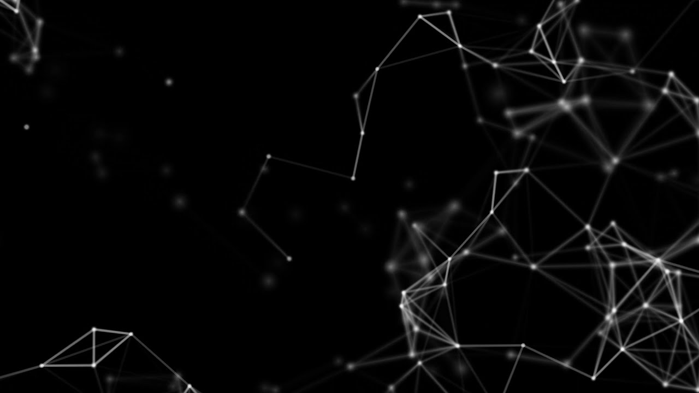

// Theme to use (see https://revealjs.com/themes/)
:revealjs_theme: moon
// Custom Theme CSS
// :revealjs_customtheme: styles/styles.css
// Slide numbers format https://revealjs.com/slide-numbers/
:revealjs_slideNumber: h/v
// Vertically centered?
:revealjs_center: true
// Show slide controls?
:revealjs_controls: true
// Slides transition: none/fade/slide/convex/concave/zoom
:revealjs_transition: concave
// Slides transition speed: default/fast/slow
:revealjs_transitionSpeed: slow
// Slide background transition: none/fade/slide/convex/concave/zoom
:revealjs_backgroundTransition: none
// Source highlighting theme
:hightlightjs-theme: nord

= Presentation Title
Author
12/03/2023

[transition=none]
== Images

[source, asciidoc]
--

--

results in:

[transition=none]
=== Background Images

[source, asciidoc]
--

--

results in:

[transition=none]
=== Background Gifs

[source, asciidoc]
--
image::media/suprise.gif[background, size=cover]
--

results in:

image::media/suprise.gif[background, size=cover]

[background-video="https://sample-videos.com/video123/mp4/720/big_buck_bunny_720p_1mb.mp4",options="loop,muted"]
=== Background Videos

[source, asciidoc]
--
[background-video="https://video.de/my.mp4",options="loop,muted"]
--

[transition=none]
== PlantUml
[source, asciidoc]
--
[graphviz]
[plantuml,alice-bob]
....
alice -> bob
....
--

results in:

[plantuml,alice-bob,svg,role=sequence]
....
alice -> bob
....

=== Graphviz

[source, asciidoc]
--
[graphviz]
....
digraph foo {
  node [style=rounded]
  node1 [shape=box]
  node2 [fillcolor=yellow, style="rounded,filled", shape=diamond]
  node3 [shape=record, label="{ a | b | c }"]

  node1 -> node2 -> node3
}
....
--

results in:

[graphviz]
....
digraph foo {
  node [style=rounded]
  node1 [shape=box]
  node2 [fillcolor=yellow, style="rounded,filled", shape=diamond]
  node3 [shape=record, label="{ a | b | c }"]

  node1 -> node2 -> node3
}
....

[.columns]
== Column layout

[.column]
--
* **Edgar Allen Poe**
* Sheri S. Tepper
* Bill Bryson
--

[.column]
--
Edgar Allan Poe (/poʊ/; born Edgar Poe; Ja
nuary 19, 1809 – October 7, 1849) was an American writer, editor, and literary critic.
--

[.columns]
=== Columns with size
[.column.is-one-third]
--
* **Kotlin**
* Java
* Scala
--

[.column]
--
Programming language for Android, mobile cross-platform
and web development, server-side, native,
and data science. Open source forever Github.
--

== Lists

[source, asciidoc]
--
* Im
* a
* List
--

results in:

* Im
* a
* List

=== Lists

[source, asciidoc]
--
. Step 1
. Step 2
.. Step 2a
.. Step 2b
. Step 3
--

results in:

. Step 1
. Step 2
.. Step 2a
.. Step 2b
. Step 3

=== Descriptions

[source, asciidoc]
--
first term:: definition of first term
second term:: definition of second term
--

results in:

first term:: definition of first term
second term:: definition of second term

== Source Code

[source, asciidoc]
--
[source, clojure]
----
(def lazy-fib
  (concat
   [0 1]
   ((fn rfib [a b]
        (lazy-cons (+ a b) (rfib b (+ a b)))) 0 1)))
----
--

results in:

[source, clojure]
----
(def lazy-fib
  (concat
   [0 1]
   ((fn rfib [a b]
        (lazy-cons (+ a b) (rfib b (+ a b)))) 0 1)))
----

== Tables

[source, asciidoc]
--
[%header, cols=2*]
|===
|Character
|Seen in

|Donald Duck
|Mickey Mouse
|===
--

results in:

[%header, cols=2*]
|===
|Character
|Seen in

|Donald Duck
|Mickey Mouse
|===

== Quotes

[quote, Albert Einstein]
A person who never made a mistake never tried anything new.

== Formulas

$ J(\theta_0,\theta_1) = \sum_{i=0} $
